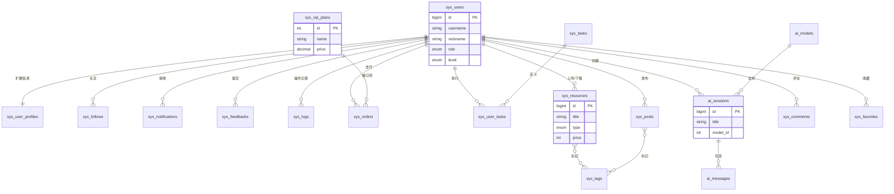

***\*目\****  ***\*录\****

[***\*一、产品概述\**** ](#_Toc1)
[***\*二、产品愿景与目标\**** ](#_Toc2)
[***\*三、产品用户分析与需求分析\**** ](#_Toc3)
[***\*四、产品功能描述\**** ](#_Toc4)
[***\*1. 功能详细描述（含技术实现）\**** ](#_Toc4_1)
[***\*2. 业务流程详细描述\**** ](#_Toc4_2)
[***\*五、产品制作数据库表设计\**** ](#_Toc5)
[***\*1. 数据库逻辑模型（E-R图描述）\**** ](#_Toc5_1)
[***\*2. 数据表结构描述\**** ](#_Toc5_2)
[***\*六、产品展示\**** ](#_Toc6)
[***\*七、总结与收获\**** ](#_Toc7)
[***\*八、教师评语及成绩评定\**** ](#_Toc8)

---

# 《前端开发技术》课程期末作业设计说明

## 一、产品概述

***\*1. 产品名称：\****
**Inspo-Verse 灵感岛** —— 基于 Vue 3 生态系统的沉浸式 AI 创意社区平台

***\*2. 产品定位：\****
“Inspo-Verse 灵感岛”是一个专为 Z 世代数字创作者、ACG 爱好者及独立开发者打造的**下一代创意集成平台**。它打破了传统论坛（如贴吧）与工具站（如 ChatGPT）之间的壁垒，将**“灵感发现”**、**“AI 辅助创作”**与**“资源共享”**无缝融合。

系统采用极具视觉冲击力的**赛博朋克（Cyberpunk）**设计语言，结合 WebGL 动态背景与霓虹光效，为用户提供沉浸式的浏览体验。技术上，它是一个完全基于 **Vue 3 + TypeScript** 构建的高性能单页应用（SPA），深度实践了前端工程化的最新标准。

***\*3. 技术架构选型：\****
本项目严格遵循现代前端开发规范，技术栈涵盖：
*   **核心框架**：Vue 3.4 (Composition API / Script Setup 语法糖)
*   **开发语言**：TypeScript 5.x (全类型约束，提升代码健壮性)
*   **构建工具**：Vite 5.x (极速冷启动与 HMR 热更新)
*   **状态管理**：Pinia (模块化状态管理，替代 Vuex)
*   **路由管理**：Vue Router 4.x (支持动态路由、路由守卫、懒加载)
*   **UI 工程化**：TailwindCSS (原子化 CSS) + Animate.css (动效库)
*   **数据可视化**：Apache ECharts 5.x (用于绘制用户成长轨迹)
*   **AI 集成**：模拟流式响应 (Streaming Response) + Markdown 渲染 (marked.js + highlight.js)

## 二、产品愿景与目标

***\*1. 产品愿景：\****
成为“数字原住民”的创意栖息地。我们希望通过 AI 技术降低创作门槛，让每一个微小的脑洞（Brainstorm）都能在灵感岛找到实现的路径——无论是生成一段代码、优化一篇文案，还是找到一个合适的 UI 组件。

***\*2. 产品核心价值主张：\****
*   **AI 赋能的创意平权 (Democratizing Creativity)**：
    通过集成的多模态 AI 助手，消除技术壁垒，让非专业开发者也能通过自然语言生成代码，让非设计师也能获得视觉灵感。我们主张“人人皆可是创作者”。
*   **沉浸式的心流体验 (Immersive Flow)**：
    拒绝传统社区枯燥的列表式设计，通过赛博朋克视觉语言、动态背景与微交互，为用户营造一种仿佛置身于未来数字城市的“心流”状态，延长用户的停留时间。
*   **一站式创意闭环 (All-in-One Loop)**：
    构建“发现灵感（探索页） -> 辅助实现（AI 助手） -> 获取素材（创意工坊） -> 社区反馈（论坛）”的完整生态闭环，用户无需在多个割裂的工具间频繁切换。

***\*3. 产品目标：\****
*   **功能目标**：构建一个包含用户认证、内容探索、AI 对话、会员成长、创意工坊、后台管理等六大闭环系统的完整应用。
*   **技术目标**：
    *   **组件化**：实现 `Button`, `Card`, `Modal` 等基础组件的高复用，封装 `useTypewriter` 等 Hooks 实现逻辑复用。
    *   **性能优化**：首屏加载时间 < 1.5s，LCP (最大内容绘制) < 2.5s。通过路由懒加载和组件异步加载实现。
    *   **响应式**：完美适配 Desktop (1920px), Tablet (768px) 及 Mobile (375px) 多端设备。
*   **体验目标**：实现“原生级”流畅交互，页面切换无白屏，AI 回复无延迟感。

## 三、产品用户分析与需求分析

***\*1. 目标用户画像：\****
*   **用户 A（21岁，大学生，二次元爱好者）**：喜欢看番、玩游戏，经常需要找高清壁纸和游戏 MOD。痛点是资源分散，且很多网站充斥广告。
*   **用户 B（25岁，前端开发工程师）**：热衷于 Side Project，需要寻找 UI 灵感和现成的组件库，开发时常遇到 Bug 需要 AI 协助。
*   **用户 C（28岁，自媒体创作者）**：需要频繁撰写脚本和文案，希望有一个能激发灵感并润色文字的智能助手。

***\*2. 市场需求与竞品分析：\****
*   **市场空缺**：目前的社区产品要么“有内容无工具”（如 B 站），要么“有工具无内容”（如各类 AI 镜像站）。Inspo-Verse 填补了**“场景化 AI”**的空白——在看内容的时候直接用 AI。
*   **竞品对比**：
    *   *vs. Discord*：Inspo-Verse 拥有更结构化的资源沉淀（创意工坊），不仅仅是聊天流。
    *   *vs. ArtStation*：Inspo-Verse 门槛更低，更偏向泛娱乐和技术分享，且具备 AI 辅助功能。

## 四、产品功能描述

### 1. 系统功能模块架构图
以下是 Inspo-Verse 灵感岛的整体功能架构设计，采用三层树状结构展示系统核心、业务模块及具体功能点：

```mermaid
flowchart TB
    Root["Inspo-Verse 灵感岛系统"]
    
    Root --- Auth["用户认证模块"]
    Root --- Content["内容生态模块"]
    Root --- AI["AI创意助手"]
    Root --- VIP["会员成长体系"]
    Root --- Admin["后台管理模块"]
    
    Auth --- Auth1["用户<br/>登录"]
    Auth --- Auth2["用户<br/>注册"]
    Auth --- Auth3["个人<br/>中心"]
    Auth --- Auth4["权限<br/>管理"]
    
    Content --- Content1["场景<br/>探索"]
    Content --- Content2["番剧<br/>追番"]
    Content --- Content3["游戏<br/>资讯"]
    Content --- Content4["创意<br/>工坊"]
    Content --- Content5["灵感<br/>论坛"]
    
    AI --- AI1["多模型<br/>切换"]
    AI --- AI2["流式<br/>响应"]
    AI --- AI3["代码<br/>高亮"]
    AI --- AI4["会话<br/>管理"]
    
    VIP --- VIP1["等级<br/>系统"]
    VIP --- VIP2["成长<br/>轨迹"]
    VIP --- VIP3["每日<br/>任务"]
    VIP --- VIP4["权益<br/>对比"]
    
    Admin --- Admin1["数据<br/>仪表盘"]
    Admin --- Admin2["用户<br/>管理"]
    Admin --- Admin3["内容<br/>审核"]
    Admin --- Admin4["AI额度<br/>监控"]
    Admin --- Admin5["系统<br/>日志"]
    
    style Root fill:#ffffff,stroke:#000,stroke-width:2px,color:#000
    style Auth fill:#ffffff,stroke:#000,stroke-width:2px,color:#000
    style Content fill:#ffffff,stroke:#000,stroke-width:2px,color:#000
    style AI fill:#ffffff,stroke:#000,stroke-width:2px,color:#000
    style VIP fill:#ffffff,stroke:#000,stroke-width:2px,color:#000
    style Admin fill:#ffffff,stroke:#000,stroke-width:2px,color:#000
    
    style Auth1 fill:#ffffff,stroke:#000,stroke-width:1px,color:#000
    style Auth2 fill:#ffffff,stroke:#000,stroke-width:1px,color:#000
    style Auth3 fill:#ffffff,stroke:#000,stroke-width:1px,color:#000
    style Auth4 fill:#ffffff,stroke:#000,stroke-width:1px,color:#000
    
    style Content1 fill:#ffffff,stroke:#000,stroke-width:1px,color:#000
    style Content2 fill:#ffffff,stroke:#000,stroke-width:1px,color:#000
    style Content3 fill:#ffffff,stroke:#000,stroke-width:1px,color:#000
    style Content4 fill:#ffffff,stroke:#000,stroke-width:1px,color:#000
    style Content5 fill:#ffffff,stroke:#000,stroke-width:1px,color:#000
    
    style AI1 fill:#ffffff,stroke:#000,stroke-width:1px,color:#000
    style AI2 fill:#ffffff,stroke:#000,stroke-width:1px,color:#000
    style AI3 fill:#ffffff,stroke:#000,stroke-width:1px,color:#000
    style AI4 fill:#ffffff,stroke:#000,stroke-width:1px,color:#000
    
    style VIP1 fill:#ffffff,stroke:#000,stroke-width:1px,color:#000
    style VIP2 fill:#ffffff,stroke:#000,stroke-width:1px,color:#000
    style VIP3 fill:#ffffff,stroke:#000,stroke-width:1px,color:#000
    style VIP4 fill:#ffffff,stroke:#000,stroke-width:1px,color:#000
    
    style Admin1 fill:#ffffff,stroke:#000,stroke-width:1px,color:#000
    style Admin2 fill:#ffffff,stroke:#000,stroke-width:1px,color:#000
    style Admin3 fill:#ffffff,stroke:#000,stroke-width:1px,color:#000
    style Admin4 fill:#ffffff,stroke:#000,stroke-width:1px,color:#000
    style Admin5 fill:#ffffff,stroke:#000,stroke-width:1px,color:#000
```

### 1. 功能详细描述（含技术实现）

本系统采用**模块化**设计，所有功能均围绕 Vue 组件、Pinia 状态与 Vue Router 路由拆分实现。以下按照实际模块逐一阐述功能点及背后的技术实现：

#### (1) 全局沉浸式 UI 框架
*   **功能**：全站统一的赛博朋克风格，包含动态网格背景、鼠标跟随光晕、磨砂玻璃导航栏以及全局 Toast / Modal 通知体系。
*   **技术实现**：
*   *   封装 `CyberBackground` 组件，通过 3D 透视、线性渐变与 `@keyframes` 动画纯 CSS 实现动态网格与扫描线效果，无需额外 Canvas 计算。
*   *   在 `App.vue` 中通过 `ref` 记录鼠标坐标，并将其注入根容器的 `radial-gradient` 背景中，营造跟随光源效果。
*   *   在根组件中挂载 `TheHeader`、异步加载的 `TheFooter`、`ToastContainer` 与 `GlobalModal`，形成“导航 + 内容视图 + 全局提示/模态框”的统一布局。
*   *   各业务页面结合 TailwindCSS 的过渡类与 Animate.css 动画类（如 `animate__fadeIn`）构建路由进入、弹窗显隐等动效，保证体验一致性。
*   *   若干信息与辅助页面（`AboutView`、`CommunityRulesView`、`ContactView`、`NotFoundView` 等）以普通视图组件形式实现，分别承载品牌介绍、社区规范说明、客服反馈表单与 404 异常引导等功能，完善整体产品体验。

#### (2) 用户认证模块 (Auth System)
*   **功能**：支持登录/注册模式切换与验证码校验，维护前端登录态，并在导航栏与受保护路由中统一体现用户身份与权限。
*   **技术实现**：
*   *   在 `LoginView` 中通过 `isLoginMode` 切换 `LoginForm` 与 `RegisterForm` 组件，使用 `<Transition mode="out-in">` 为模式切换添加卡片淡入淡出动画。
*   *   登录、注册表单使用 **VeeValidate + Yup** 定义校验 Schema，校验用户名长度、手机号格式、密码复杂度与两次密码一致性，并集成自定义 `Captcha` 组件完成前端图形验证码校验。
*   *   成功登录后调用 Pinia `authStore.login()`，将用户信息与 `token` 写入 Store 与 `localStorage`；在 `authStore.initAuth()` 中于应用启动时恢复持久化登录状态。
*   *   顶部导航栏 `TheHeader` 通过 `useAuthStore` 的 `isAuthenticated` 与 `user` 控制“登录 / 注册”按钮与用户头像下拉菜单的显示，支持一键退出登录。
*   *   在 `router.beforeEach` 中结合路由 `meta.requiresAuth` 字段，对 `/ai-chat`、`/user`、`/vip`、`/admin` 等受保护页面做统一权限拦截，未登录时重定向到登录页。
*   *   个人中心页面 `UserCenterView` 在通过路由守卫确保登录后访问，内部使用 Tab 切换聚合“个人资料 / 订单 / 创作 / 钱包 / 安全设置”等功能，并通过 `Promise.all` 并发模拟拉取用户信息与订单列表。

#### (3) 内容探索与创意工坊 (Explore & Workshop)
*   **功能**：围绕“发现灵感”展示动漫、游戏、AI 绘图与工坊资源，支持分类筛选、搜索、瀑布流展示以及详情模态框浏览。
*   **技术实现**：
*   *   `HomeView` 通过 Banner 轮播、平台特性卡片与推荐创作者列表，引导用户进入“探索 / 游戏 / 番剧 / 创意工坊 / 论坛 / AI 助手”等核心功能模块。
*   *   `ExploreView` 使用本地 `posts` 列表配合 `computed filteredPosts`，综合分类、搜索关键字等条件做前端过滤；主体区域使用 CSS `columns` 实现响应式瀑布流布局。
*   *   探索详情弹窗通过 `<transition name="modal">` + 固定定位遮罩实现，内部展示大图、简介、标签与模拟评论区，并在底部提供点赞和评论操作按钮。
*   *   游戏与番剧页面 `GamesView`、`AnimeView` 同样以本地数组驱动资源卡片与详情弹窗，展示评分、发行日期、标签等字段，为不同内容场景提供专门的浏览入口。
*   *   创意工坊 `WorkshopView` 中维护 `mods` 资源数组，选中项 `selectedItem` 触发全屏模态框，展示资源介绍、版本/大小/更新日期与订阅/收藏/分享按钮，完全由前端状态驱动交互流程。

#### (4) 社区论坛与发帖模块 (Forum)
*   **功能**：提供多板块讨论区、热门/最新排序、搜索过滤以及需登录方可使用的发帖功能，承载用户间的交流与反馈。
*   **技术实现**：
*   *   在 `ForumView` 中通过 `boards` 配置“全部板块 / 游戏综合 / 动漫新番 / AI 绘图 / 闲聊灌水”等子板块，`activeBoard`、`sortMode`、`searchQuery` 三个状态组合在 `computed filteredPosts` 中完成板块过滤、热度/时间排序与关键词搜索。
*   *   帖子列表采用 `transition-group` 渲染，为每条帖子提供进入/离场动画，并使用 `isTop`、`isHot` 字段配合样式高亮置顶和热门帖子。
*   *   新帖发布弹窗由 `isNewPostModalOpen` 控制，内部使用 `reactive newPostForm` 绑定标题、板块与内容字段，通过 `setTimeout` 模拟接口延迟后将新帖子插入 `posts` 列表头部。
*   *   在 `openNewPostModal` 中通过 Pinia 的 `authStore.isAuthenticated` 判定登录状态，未登录时调用全局 Toast (`useToastStore`) 给出提示并阻止弹窗打开，从而形成“登录 → 发帖”的权限链路。

#### (5) AI 创意助手 (AI Copilot)
*   **功能**：支持灵感创作、精确问答与代码编程三种模型模式，对话界面支持 Markdown 富文本渲染、会话历史切换与流式输出效果。
*   **技术实现**：
*   *   在 `AIChatView` 中组合 `HistoryPanel`（会话列表）、`MessageList`（消息展示）与 `InputArea`（输入区域），并通过顶部模型选择器将 UI 与 `chatStore.currentModel` 绑定，切换不同助手风格与欢迎语。
*   *   Pinia `chatStore` 以 `Conversation{id, title, messages[], updatedAt}` 结构管理会话，在 `initChat()` 中预置示例对话，在 `createNewConversation()` 中插入带欢迎语的新会话。
*   *   `sendMessage(content)` 先将用户消息写入当前会话，再创建一个空内容的 AI 消息占位，将 `generateMockResponse(content, currentModel)` 返回的字符串拆分为字符数组，通过 `await new Promise` 逐字符追加到消息内容中，模拟大模型流式输出。
*   *   `MessageList` 通过 `marked` 将 Markdown 文本解析为 HTML，并用 `DOMPurify.sanitize` 清洗后通过 `v-html` 渲染，同时在 `.markdown-body` 下使用 Tailwind 工具类为段落、标题、列表、引用与代码块定义暗色主题样式，实现代码块的样式高亮。
*   *   借助 `watch` 监听消息数量与最后一条消息内容变化，在每次更新后使用 `nextTick` 将滚动容器滚动到底部，保证最新 AI 回复始终可见。

#### (6) 会员成长体系 (User Growth)
*   **功能**：在会员中心展示不同会员等级（白银公民/黄金极客/赛博领主）、成长值曲线、每日任务列表及权益对比，塑造长期留存机制。
*   **技术实现**：
*   *   在 `VipCenterView` 中通过 `plans`、`privileges`、`tasks` 三组配置渲染会员方案卡片、权益网格与每日任务列表，使用渐变背景与图标组件营造差异化视觉层级。
*   *   任务列表根据 `progress/total` 计算完成进度条宽度，并通过状态字段控制“已完成 / 去完成 / 进度数字”等文案显示。
*   *   使用 ECharts 在组件挂载时初始化折线面积图展示“灵感值/积分”随月份的变化趋势，并监听窗口 `resize` 事件在尺寸变更时调用 `chart.resize()` 实现图表自适应。
*   *   会员卡片借助 CSS3 `transform` 与阴影效果在 Hover 态下产生微小的透视与浮起效果，突出推荐档位，提升交互质感。

#### (7) 后台管理系统 (Admin Dashboard)
*   **功能**：通过 `/admin` 根路由提供前端模拟的后台运营控制台，包含数据仪表盘、用户管理、内容审核、订单管理与 AI 调用监控等功能。
*   **技术实现**：
*   *   在 `router/index.ts` 中为 `/admin` 配置 `children`，分别指向 `DashboardView`、`UserManagement`、`PostManagement`、`ExploreManagement`、`AIMonitor` 与 `OrderManagement` 等子页面，实现“左侧菜单 + 右侧内容区”的嵌套路由布局。
*   *   `DashboardView` 使用 ECharts 绘制用户增长与收入构成图表，并配合顶部统计卡片展示核心指标，所有数据均来自本地 Mock，方便课堂环境下演示。
*   *   用户管理/帖子管理/订单管理页面通过表格组件展示 Mock 数据，结合按钮操作实现搜索、过滤、置顶/取消置顶、删除与状态切换等典型后台交互。
*   *   `AIMonitor` 维护 AI 请求日志数组，记录使用模型、Prompt 摘要、请求状态与 Token 消耗等信息，以卡片和列表形式展示前端 AI 调用的“监控视角”。
*   *   `/admin` 路由同样标记 `meta.requiresAuth: true`，与全局 `router.beforeEach` 守卫配合，实现管理员后台访问前必须先登录的前端权限控制链路。

### 2. 业务流程详细描述

#### 用户旅程概述

"Inspo-Verse 灵感岛"的用户旅程始于用户被赛博朋克风格与AI创意理念所吸引。进入平台后，核心体验在于高度沉浸的内容探索与AI辅助创作流程：用户通过浏览精选的动漫、游戏、创意工坊资源获取灵感，随后借助多模型AI助手将灵感转化为实际作品，从被动浏览者转变为主动创作者，获得强烈的参与感与成就感。系统通过清晰的会员成长体系建立长期激励，并通过论坛社区实现用户间的交流互动。最终，用户在持续的创作与分享中建立对平台的依赖与忠诚，完成从"发现"到"创作"再到"分享"的完整闭环。

#### (1) 首次访问与首页导航流程

用户首次访问 Inspo-Verse 灵感岛网站（P-HOME）时，浏览器加载基于 Vue 3 + Vite 构建的单页应用。顶层 `App.vue` 挂载了动态 3D 网格背景、鼠标跟随光晕以及全局 Toast / Modal 组件，营造出沉浸式的赛博朋克氛围。

首页（HomeView）通过导航栏（TheHeader）提供到各大功能模块的入口，包括“探索”“游戏”“番剧”“创意工坊”“论坛”“AI 助手”“会员中心”“个人中心”“登录 / 注册”“社区规范”“联系客服”等。用户在不刷新页面的前提下，即可通过 Vue Router 的前端路由在不同视图间自由切换，路由切换过程由 `Transition` 与 Animate.css 提供平滑的淡入淡出动效。

#### (2) 登录 / 注册与权限控制流程

当用户点击导航栏中的“登录 / 注册”按钮时，系统跳转至认证页面（P-LOGIN，对应 LoginView）。页面中间是一个毛玻璃风格的卡片容器，通过内部状态 `isLoginMode` 在“登录表单”和“注册表单”之间切换，并使用 `<Transition>` 为模式切换提供动画。

- 注册流程：用户在注册表单（RegisterForm）中依次填写用户名、手机号、密码、确认密码与图形验证码。前端使用 `vee-validate + yup` 进行实时校验，确保用户名格式、手机号合法性、密码强度等均满足约束。验证码由自定义组件 `Captcha` 动态生成并绘制在 `<canvas>` 中。当前版本中，注册逻辑采用本地 Mock 的方式：提交表单后模拟网络延迟，给出“注册成功”反馈，引导用户返回登录，不在本地持久化用户列表。
- 登录流程：用户在登录表单（LoginForm）中输入用户名与密码。前端同样使用 `vee-validate` 做基本校验。业务上采用一个固定账号 `admin/admin123` 作为演示账户。提交后，若凭证正确，则调用 `authStore.login()`，将用户信息与 `token` 写入 Pinia 状态树与 `localStorage`，随后使用 `router.push('/')` 返回首页；若凭证错误，则增加失败次数并在多次失败后强制显示验证码，提升安全性。

在路由层面，全局前置守卫 `router.beforeEach` 会在用户每次跳转前检查目标路由的 `meta.requiresAuth` 字段。对于 `/ai-chat`、`/user`、`/vip` 以及 `/admin` 等受保护路由，当本地不存在合法 `token` 时，系统会自动重定向至登录页（P-LOGIN），确保只有通过认证的用户才能访问核心功能模块。

#### (3) 内容探索与创意工坊浏览流程

登录与否并不影响用户浏览公开内容。用户可以通过首页 Banner、导航栏或路由直接进入内容探索相关页面：

- 探索页（P-EXPLORE，对应 ExploreView）：页面顶部提供搜索框与分类筛选（全部推荐 / AI 绘图 / 游戏攻略 / 番剧二创），主体区域以卡片流的形式展示本地 Mock 的内容列表。每条内容包含封面图、标题、作者、点赞数、评论数与标签。用户可以通过切换分类、输入关键字等方式过滤列表，当点击某一内容卡片时，会弹出详情浮层展示更完整的简介与配图。
- 游戏 / 番剧专页（P-GAMES / P-ANIME）：这两个页面对 Explore 页的展示方式进行进一步主题化，使用不同的文案与卡片组合，突出各自的内容风格，方便用户快速定位到自己关注的领域。
- 创意工坊（P-WORKSHOP，对应 WorkshopView）：以“MOD / 资源”卡片的形式展示各类可订阅资源，如 UI Kit、Shader、音效包等。用户点击任意卡片，会打开全屏详情模态框，其中包含资源说明、版本号、大小、更新时间以及标签列表。底部的“立即订阅”按钮与收藏 / 分享按钮目前主要用于演示交互流与视觉反馈，为后续接入真实订单与下载接口预留了交互位置。

整个内容探索与工坊浏览流程全部在前端完成，依赖本地模拟数据与组件化卡片布局，重点体现的是信息组织与交互体验设计。

#### (4) 论坛发帖与社区互动流程

当用户希望与其他创作者交流时，可以通过导航进入论坛页面（P-FORUM，对应 ForumView）。左侧为看板导航，提供“全部板块”“游戏综合”“动漫新番”“AI 绘图”“闲聊灌水”等多个子板块；右侧为帖子列表，支持按热度 / 时间排序与关键字搜索。

- 浏览流程：用户通过点击不同看板按钮切换板块过滤条件，帖子列表会根据当前板块与搜索关键字实时计算得到。置顶帖与热门帖在列表顶部显示，用醒目的标签和样式进行强调。
- 发帖流程：用户点击左侧“发布新帖”按钮时，系统首先检查 `authStore.isAuthenticated`。若用户尚未登录，则通过全局 Toast 提示“请先登录后再发布帖子”，并阻止弹出发布框；若用户已登录，则打开“发布新帖”模态框，允许用户选择板块、填写标题与内容（支持 Markdown）。点击“发布”后，前端模拟网络延迟，再将新帖插入本地 `posts` 列表顶部，实现从“提交表单”到“列表实时更新”的闭环。

后台的帖子管理模块（Admin/PostManagement）则复用同一套帖子数据结构，通过“置顶 / 取消置顶”“删除帖子”等操作模拟管理侧审核与运营流程。

#### (5) AI 创意助手对话流程

当用户在创作过程中需要 AI 协助时，可以通过导航进入 AI 对话页面（P-AI-CHAT，对应 AIChatView）。由于该页面在路由上标记了 `requiresAuth: true`，用户只有在登录成功后才能访问。

- 进入页面时，组件会调用 `chatStore.initChat()` 初始化会话数据。该方法在 Pinia 中预置了数个示例会话（如“赛博朋克游戏文案”“Vue 组件通信疑问”等），并自动创建一个当前活跃会话。
- 左侧侧边栏展示会话历史列表，用户可以点击切换不同会话或创建“新对话”，每个会话由 `Conversation{id, title, messages[], updatedAt}` 结构管理。
- 顶部模型选择下拉菜单与 `chatStore.currentModel` 绑定，提供“灵感创作（creative）”“精确问答（precise）”“代码编程（coding）”三种模式。当前选择模型会影响欢迎语与 AI 回复风格。
- 当用户在底部输入框中输入问题并点击发送时，页面调用 `chatStore.sendMessage(content)`：首先将用户消息追加到当前会话的 `messages` 数组中，然后构造一个空内容的 AI 消息占位，并按字符逐步填充 `content` 字段，从而在界面上形成类似大模型流式输出的打字机效果。
- 对于代码模式，预置的回复内容直接以 Markdown 代码块的形式返回，前端通过 Markdown 渲染与语法高亮组件进行展示，并在代码块区域提供“一键复制”按钮，方便用户将代码复制到编辑器中继续调试。

当前版本中，AI 回复由前端本地函数 `generateMockResponse` 生成，但从会话结构设计到 UI 呈现都已经为接入真实 LLM 接口预留了完整的数据与交互通路。

#### (6) 会员中心与成长任务流程

会员中心页面（P-VIP，对应 VipCenterView）重点展示用户成长体系与会员权益设计，是用户从“免费体验”走向“深度使用”的关键触点。

- 会员权益浏览：页面上半部分以卡片形式展示三档会员计划（白银公民、黄金极客、赛博领主），每张卡片包含价格、主要权益列表及视觉强调效果。用户可以通过比对不同卡片了解各会员等级在 AI 调用次数、响应速度、模型等级等方面的差异。
- 任务与积分：中部区域展示每日任务列表（签到、发布动态、邀请新用户、使用 AI 绘图等），每一行任务包含奖励积分、当前进度与状态（如“已完成”“去完成”“3/5”）。当前版本中，这些任务数据由本地数组驱动，主要用于演示“任务 → 积分 → 成长”的业务流。
- 成长曲线可视化：底部通过 ECharts 渲染折线面积图，横轴为月份，纵轴为“灵感值”或积分。图表会在组件挂载时初始化并监听窗口尺寸变化，实现自适应布局，用可视化方式向用户反馈成长趋势。

在整体用户旅程中，会员中心既是产品价值展示页，也是后续接入实际会员订阅、任务系统与积分商城的承载页面。

#### (7) 个人资料、订单与安全管理流程

个人中心页面（P-USER，对应 UserCenterView）从“我的”视角聚合了账号资料、历史订单、行为记录与安全设置，是用户自我管理的核心入口。

- 数据加载：页面挂载时调用 `fetchData()`，通过 `Promise.all` 并发模拟“获取用户基础信息”和“拉取订单列表”两个请求。用户信息从 `authStore.user` 中读取，并在前端为手机号与个性签名提供默认值；订单列表则以本地 Mock 的方式构造，覆盖“黄金会员年卡”“AI 点数包”“周边商品”等典型订单场景。
- 资料编辑：在“个人资料”标签页中，用户可以修改昵称、手机号与个人简介。输入过程中通过 `lodash.debounce` 实现防抖校验。点击“保存”时，页面调用全局模态框 `modalStore.open()` 做二次确认，确认后再更新 Pinia 中的 `authStore.user.nickname` 并通过 Toast 提示保存成功。
- 订单与行为记录：在“订单记录”标签页展示历史订单表格，在“行为记录”标签页以时间线形式展示积分变化与关键行为（如 AI 消耗、任务奖励），帮助用户回顾自己的使用轨迹。
- 账号安全：在“账号安全”标签页中，页面提供修改密码、二步验证等入口，目前以前端表单与文案为主，为后续接入真实安全接口预留场景。

通过这一套流程，用户可以直观地管理与回顾自己在 Inspo-Verse 中的使用情况。

#### (8) 后台运营与监控流程

为了完整展示前后端协同思路，项目实现了一个前端模拟的后台运营控制台（P-ADMIN），通过 `/admin` 根路由与嵌套路由组织多个子模块。

- 访问控制：`/admin` 路由同样带有 `requiresAuth` 标记，只有在本地存在 `token` 时才允许访问。当前版本未在前端强制区分普通用户与管理员角色，以便课堂演示时快速体验全部后台功能。
- 仪表盘：DashboardView 通过两张 ECharts 图表展示“总用户 / 活跃用户变化趋势”和“订单收入构成（游戏会员、周边商城、课程订阅等）”，并配合头部统计卡片展示关键指标。
- 用户管理：UserManagement 列表中展示 Mock 的用户数据，包括昵称、邮箱、角色（普通 / 管理员 / VIP）、状态与注册时间。顶部支持搜索与过滤操作，底部提供禁用 / 解封等操作按钮，用于演示典型的后台表格交互。
- 帖子管理：PostManagement 显示论坛帖子的简化信息，管理员可以对帖子进行置顶 / 取消置顶、删除等操作，所有关键操作均通过全局 Modal 进行确认，并通过 Toast 给出结果反馈。
- 订单管理与 AI 监控：OrderManagement 用于查看订单号、商品、金额与状态；AIMonitor 用一个简单的表格记录“请求用户、使用模型、Prompt 摘要、请求状态、Token 消耗”等信息，构成对前端 AI 调用行为的可视化监控。

这一整套后台流程使得 Inspo-Verse 不仅具备“面向用户的前台体验”，也具备从运营视角观察与管理系统的能力。

#### (9) 联系客服与用户反馈流程

当用户遇到问题或希望提交建议时，可以通过导航栏进入“联系客服”页面（P-CONTACT，对应 ContactView）。该页面一侧以卡片方式展示官方邮箱、紧急联系电话与总部地址等信息，另一侧则展示反馈表单。

- 用户在表单中填写称呼、邮箱与消息内容后点击“发送信号”，前端会模拟网络请求（通过 `setTimeout` 延时），请求成功后清空表单并通过全局 Toast 提示“消息已发送，我们会尽快回复”，在交互上营造出“发送全息讯息给客服中心”的体验。
- 在数据库设计中，对应 `sys_feedbacks` 表记录所有反馈，后续可以与后台管理模块联动，实现客服工单流程与用户回访。

#### (10) 异常路由与 404 流程

当用户在地址栏中输入了一个不存在的路径时，前端路由会匹配到 `/:pathMatch(.*)*` 通配符路由，渲染自定义的 404 页面（NotFoundView）。页面通过赛博朋克风格的文案与按钮，引导用户返回首页或其他核心模块，避免用户在错误路径上迷失，从而完善整体产品体验闭环。

## 五、产品制作数据库表设计

### 1. 数据库表E-R图描述

利用实体-关系模型识别、描述数据库中的实体、属性与关系，为数据建模打基础。采用规范化技术将数据库设计成关系模式，消除冗余数据、提升一致性，优化存储与查询效率。依据需求与规范化流程设计数据库表，明确表间关系，同时考虑表结构、字段类型、主键、外键和约束等。为提高查询效率，设计合适索引，借助索引按列快速搜索数据。

为了全面支撑 Inspo-Verse 灵感岛的复杂业务逻辑，包括登录/注册（P-LOGIN）、探索页与创意工坊（P-EXPLORE / P-WORKSHOP / P-GAMES / P-ANIME）、论坛社区（P-FORUM）、AI 创意助手（P-AI-CHAT）、个人中心与会员中心（P-USER / P-VIP）、后台运营控制台（P-ADMIN）以及联系反馈（P-CONTACT）等功能模块，本系统共设计了 **20** 个数据表。这些数据表构建了一个高内聚、低耦合的关系型数据模型，与实际前端路由和业务页面一一对应。

#### 核心实体关系概述：

1.  **用户中心 (User Center)**：`sys_users` 为核心，关联 `sys_user_profiles`（扩展信息）、`sys_vip_plans`（会员订阅）、`sys_follows`（社交关注），共同支撑登录/注册页面、个人中心（UserCenterView）以及后台用户管理（Admin/UserManagement）中用户信息、等级与关系网络的展示与维护。
2.  **AI 助手 (AI Copilot)**：`ai_sessions` 记录会话窗口，`ai_messages` 存储多轮对话消息，`ai_models` 定义可选模型及权限，直接支撑 AI 对话页（AIChatView）和后台 AI 监控页（Admin/AIMonitor）中的会话列表、流式回复与模型切换能力。
3.  **内容生态 (Content Ecosystem)**：`sys_resources`（创意工坊与探索内容）、`sys_posts`（论坛帖子）作为主要内容载体，通过 `sys_tags` 进行分类，通过 `sys_comments` 和 `sys_favorites` 实现评论与收藏交互，对应探索页（ExploreView、GamesView、AnimeView）、创意工坊（WorkshopView）和论坛（ForumView）的内容流与互动行为。
4.  **任务与成长 (Growth System)**：`sys_tasks` 定义每日任务与奖励规则，`sys_user_tasks` 追踪用户完成进度并发放积分奖励，配合 `sys_vip_plans` 与用户积分字段，共同支撑会员中心（VipCenterView）中任务列表、积分成长曲线以及会员权益对比。
5.  **运营与反馈 (Operations)**：`sys_orders` 记录交易流水（会员订阅、点数包与周边等），`sys_feedbacks` 收集用户在“联系客服”（ContactView）中提交的建议，`sys_notifications` 负责站内消息触达，`sys_logs` 和 `sys_daily_stats` 为后台仪表盘（DashboardView）提供运营统计与审计数据。

图 5.1 展示了 Inspo-Verse 灵感岛系统的完整 E-R 图，清晰描述了各实体间的关联关系。

图 5.1 Inspo-Verse 系统数据库 E-R 图

### 2. 数据表描述

MySQL是被广泛使用的数据库系统之一，在各种应用场景中都有很好的表现，它具有成熟和稳定的特性，能够处理大量的并发请求，并保证数据的一致性和可靠性。在本项目中，我们设计了以下核心数据表来支撑业务逻辑。

#### 2.1 用户中心模块

1. **用户表 (sys_users)**：存储账号核心信息，用于认证与鉴权。

| 列名 | 类型 | 长度 | 可空 | 主键 | 描述 |
| :--- | :--- | :--- | :--- | :--- | :--- |
| id | BIGINT | 20 | NO | True | 用户主键ID |
| username | VARCHAR | 50 | NO | False | 登录账号 |
| email | VARCHAR | 100 | NO | False | 绑定邮箱 |
| password_hash | VARCHAR | 255 | NO | False | 密码哈希 |
| nickname | VARCHAR | 50 | YES | False | 用户昵称 |
| avatar_url | VARCHAR | 500 | YES | False | 头像地址 |
| role | ENUM | 10 | NO | False | 角色(user/admin) |
| level | ENUM | 10 | NO | False | 会员等级(normal/silver/gold/diamond) |
| points | INT | 11 | NO | False | 账户积分余额 |
| status | ENUM | 10 | NO | False | 状态(active/banned) |
| created_at | TIMESTAMP | 19 | NO | False | 注册时间 |

2. **用户档案表 (sys_user_profiles)**：存储非核心的用户扩展信息，实现冷热数据分离。

| 列名 | 类型 | 长度 | 可空 | 主键 | 描述 |
| :--- | :--- | :--- | :--- | :--- | :--- |
| user_id | BIGINT | 20 | NO | True | 用户ID (FK) |
| bio | VARCHAR | 255 | YES | False | 个人简介 |
| location | VARCHAR | 100 | YES | False | 所在地 |
| website | VARCHAR | 200 | YES | False | 个人网站 |
| social_links | JSON | 0 | YES | False | 社交媒体链接(JSON) |
| preferences | JSON | 0 | YES | False | 用户偏好设置 |

3. **关注表 (sys_follows)**：记录用户之间的社交关注关系。

| 列名 | 类型 | 长度 | 可空 | 主键 | 描述 |
| :--- | :--- | :--- | :--- | :--- | :--- |
| id | BIGINT | 20 | NO | True | 关注记录ID |
| follower_id | BIGINT | 20 | NO | False | 关注者ID |
| following_id | BIGINT | 20 | NO | False | 被关注者ID |
| created_at | TIMESTAMP | 19 | NO | False | 关注时间 |

#### 2.2 AI 创意助手模块

4. **AI会话表 (ai_sessions)**：记录用户创建的每一个对话窗口。

| 列名 | 类型 | 长度 | 可空 | 主键 | 描述 |
| :--- | :--- | :--- | :--- | :--- | :--- |
| id | BIGINT | 20 | NO | True | 会话ID |
| user_id | BIGINT | 20 | NO | False | 用户ID |
| title | VARCHAR | 100 | NO | False | 会话标题 |
| model_id | INT | 11 | NO | False | 使用的模型ID |
| is_archived | TINYINT | 1 | NO | False | 是否归档 |
| created_at | TIMESTAMP | 19 | NO | False | 创建时间 |
| updated_at | TIMESTAMP | 19 | NO | False | 最后活跃时间 |

5. **AI消息表 (ai_messages)**：存储对话历史记录，支持 Markdown 格式。

| 列名 | 类型 | 长度 | 可空 | 主键 | 描述 |
| :--- | :--- | :--- | :--- | :--- | :--- |
| id | BIGINT | 20 | NO | True | 消息ID |
| session_id | BIGINT | 20 | NO | False | 会话ID |
| role | ENUM | 10 | NO | False | 发送角色(user/assistant/system) |
| content | TEXT | 0 | NO | False | 消息内容 |
| token_usage | INT | 11 | YES | False | 消耗Token数 |
| created_at | TIMESTAMP | 19 | NO | False | 发送时间 |

6. **AI模型表 (ai_models)**：定义系统支持的 LLM 模型配置，与前端 AI 对话页中的模型下拉菜单保持一致。

| 列名 | 类型 | 长度 | 可空 | 主键 | 描述 |
| :--- | :--- | :--- | :--- | :--- | :--- |
| id | INT | 11 | NO | True | 模型ID |
| name | VARCHAR | 50 | NO | False | 模型名称(e.g., GPT-4) |
| code | VARCHAR | 50 | NO | False | 调用代码(creative/precise/coding) |
| description | VARCHAR | 255 | YES | False | 功能描述 |
| vip_required | TINYINT | 1 | NO | False | 是否VIP专属 |

#### 2.3 创意社区与内容模块

7. **创意资源表 (sys_resources)**：存储工坊中的模型、插件等资源。

| 列名 | 类型 | 长度 | 可空 | 主键 | 描述 |
| :--- | :--- | :--- | :--- | :--- | :--- |
| id | BIGINT | 20 | NO | True | 资源ID |
| user_id | BIGINT | 20 | NO | False | 发布者ID |
| title | VARCHAR | 100 | NO | False | 资源标题 |
| type | ENUM | 20 | NO | False | 类型(mod/asset/tool) |
| description | TEXT | 0 | YES | False | 详细描述 |
| cover_url | VARCHAR | 500 | NO | False | 封面图URL |
| file_url | VARCHAR | 500 | NO | False | 下载链接 |
| price | INT | 11 | NO | False | 积分价格(0为免费) |
| download_count | INT | 11 | NO | False | 下载次数 |
| created_at | TIMESTAMP | 19 | NO | False | 发布时间 |

8. **社区帖子表 (sys_posts)**：存储论坛帖子内容。

| 列名 | 类型 | 长度 | 可空 | 主键 | 描述 |
| :--- | :--- | :--- | :--- | :--- | :--- |
| id | BIGINT | 20 | NO | True | 帖子ID |
| user_id | BIGINT | 20 | NO | False | 作者ID |
| title | VARCHAR | 100 | NO | False | 标题 |
| category | VARCHAR | 50 | NO | False | 板块(game/anime/ai/chat) |
| content | TEXT | 0 | NO | False | 内容(HTML/Markdown) |
| view_count | INT | 11 | NO | False | 浏览量 |
| like_count | INT | 11 | NO | False | 点赞数 |
| is_top | TINYINT | 1 | NO | False | 是否置顶 |
| created_at | TIMESTAMP | 19 | NO | False | 发布时间 |

9. **评论表 (sys_comments)**：统一的评论管理表，支持对资源和帖子进行评论。

| 列名 | 类型 | 长度 | 可空 | 主键 | 描述 |
| :--- | :--- | :--- | :--- | :--- | :--- |
| id | BIGINT | 20 | NO | True | 评论ID |
| user_id | BIGINT | 20 | NO | False | 评论人ID |
| target_id | BIGINT | 20 | NO | False | 目标ID |
| target_type | ENUM | 20 | NO | False | 目标类型(post/resource) |
| content | VARCHAR | 1000 | NO | False | 评论内容 |
| parent_id | BIGINT | 20 | YES | False | 父评论ID(回复功能) |
| created_at | TIMESTAMP | 19 | NO | False | 评论时间 |

10. **标签表 (sys_tags)**：定义内容标签。

| 列名 | 类型 | 长度 | 可空 | 主键 | 描述 |
| :--- | :--- | :--- | :--- | :--- | :--- |
| id | INT | 11 | NO | True | 标签ID |
| name | VARCHAR | 50 | NO | False | 标签名称 |
| color | VARCHAR | 20 | YES | False | 显示颜色 |

11. **资源-标签关联表 (sys_resource_tags)**

| 列名 | 类型 | 长度 | 可空 | 主键 | 描述 |
| :--- | :--- | :--- | :--- | :--- | :--- |
| resource_id | BIGINT | 20 | NO | True | 资源ID |
| tag_id | INT | 11 | NO | True | 标签ID |

12. **收藏表 (sys_favorites)**：记录用户的收藏行为。

| 列名 | 类型 | 长度 | 可空 | 主键 | 描述 |
| :--- | :--- | :--- | :--- | :--- | :--- |
| id | BIGINT | 20 | NO | True | 收藏ID |
| user_id | BIGINT | 20 | NO | False | 用户ID |
| target_id | BIGINT | 20 | NO | False | 目标ID |
| target_type | ENUM | 20 | NO | False | 目标类型(post/resource) |
| created_at | TIMESTAMP | 19 | NO | False | 收藏时间 |

#### 2.4 会员成长与任务模块

13. **会员套餐表 (sys_vip_plans)**：定义不同的会员订阅计划，对应会员中心页中“白银公民 / 黄金极客 / 赛博领主”等套餐卡片。

| 列名 | 类型 | 长度 | 可空 | 主键 | 描述 |
| :--- | :--- | :--- | :--- | :--- | :--- |
| id | INT | 11 | NO | True | 套餐ID |
| name | VARCHAR | 50 | NO | False | 套餐名称(如:黄金极客) |
| price | DECIMAL | 10,2 | NO | False | 价格 |
| duration_days | INT | 11 | NO | False | 有效天数 |
| privileges | JSON | 0 | YES | False | 权益列表(JSON) |

14. **任务配置表 (sys_tasks)**：定义每日任务与奖励，对应会员中心页中“每日签到、发布动态、邀请新用户”等任务配置。

| 列名 | 类型 | 长度 | 可空 | 主键 | 描述 |
| :--- | :--- | :--- | :--- | :--- | :--- |
| id | INT | 11 | NO | True | 任务ID |
| title | VARCHAR | 100 | NO | False | 任务标题 |
| reward_points | INT | 11 | NO | False | 奖励积分 |
| target_count | INT | 11 | NO | False | 目标完成次数 |
| type | VARCHAR | 50 | NO | False | 任务类型(daily/weekly) |

15. **用户任务记录表 (sys_user_tasks)**：追踪用户任务完成进度。

| 列名 | 类型 | 长度 | 可空 | 主键 | 描述 |
| :--- | :--- | :--- | :--- | :--- | :--- |
| id | BIGINT | 20 | NO | True | 记录ID |
| user_id | BIGINT | 20 | NO | False | 用户ID |
| task_id | INT | 11 | NO | False | 任务ID |
| progress | INT | 11 | NO | False | 当前进度 |
| status | ENUM | 10 | NO | False | 状态(ongoing/completed) |
| updated_at | TIMESTAMP | 19 | NO | False | 更新时间 |

#### 2.5 运营与系统模块

16. **交易订单表 (sys_orders)**：记录所有资金变动，对应个人中心与后台订单管理中展示的会员年卡、点数包与周边订单。

| 列名 | 类型 | 长度 | 可空 | 主键 | 描述 |
| :--- | :--- | :--- | :--- | :--- | :--- |
| id | BIGINT | 20 | NO | True | 订单ID |
| order_no | VARCHAR | 64 | NO | False | 业务订单号 |
| user_id | BIGINT | 20 | NO | False | 用户ID |
| type | ENUM | 20 | NO | False | 类型(vip_sub/resource_buy) |
| amount | DECIMAL | 10,2 | NO | False | 金额 |
| pay_method | ENUM | 20 | NO | False | 支付方式 |
| status | ENUM | 20 | NO | False | 状态(paid/pending) |
| created_at | TIMESTAMP | 19 | NO | False | 创建时间 |

17. **系统通知表 (sys_notifications)**：站内消息通知。

| 列名 | 类型 | 长度 | 可空 | 主键 | 描述 |
| :--- | :--- | :--- | :--- | :--- | :--- |
| id | BIGINT | 20 | NO | True | 通知ID |
| user_id | BIGINT | 20 | NO | False | 接收用户ID |
| title | VARCHAR | 100 | NO | False | 标题 |
| content | TEXT | 0 | NO | False | 内容 |
| is_read | TINYINT | 1 | NO | False | 是否已读 |
| created_at | TIMESTAMP | 19 | NO | False | 发送时间 |

18. **用户反馈表 (sys_feedbacks)**：收集用户提交的建议与问题，对应“联系客服”页面中的联系表单提交记录。

| 列名 | 类型 | 长度 | 可空 | 主键 | 描述 |
| :--- | :--- | :--- | :--- | :--- | :--- |
| id | BIGINT | 20 | NO | True | 反馈ID |
| user_id | BIGINT | 20 | YES | False | 用户ID(可选) |
| name | VARCHAR | 50 | YES | False | 联系人姓名 |
| email | VARCHAR | 100 | YES | False | 联系邮箱 |
| message | TEXT | 0 | NO | False | 反馈内容 |
| status | ENUM | 20 | NO | False | 处理状态 |
| created_at | TIMESTAMP | 19 | NO | False | 提交时间 |

19. **系统日志表 (sys_logs)**：记录关键操作日志。

| 列名 | 类型 | 长度 | 可空 | 主键 | 描述 |
| :--- | :--- | :--- | :--- | :--- | :--- |
| id | BIGINT | 20 | NO | True | 日志ID |
| user_id | BIGINT | 20 | YES | False | 操作者ID |
| action | VARCHAR | 50 | NO | False | 动作类型 |
| ip | VARCHAR | 50 | YES | False | IP地址 |
| params | JSON | 0 | YES | False | 请求参数 |
| created_at | TIMESTAMP | 19 | NO | False | 记录时间 |

20. **每日统计表 (sys_daily_stats)**：用于后台仪表盘的数据统计。

| 列名 | 类型 | 长度 | 可空 | 主键 | 描述 |
| :--- | :--- | :--- | :--- | :--- | :--- |
| date | DATE | 0 | NO | True | 统计日期 |
| new_users | INT | 11 | NO | False | 新增用户数 |
| active_users | INT | 11 | NO | False | 活跃用户数 |
| total_posts | INT | 11 | NO | False | 发帖总数 |
| total_income | DECIMAL | 10,2 | NO | False | 总收入 |

## 六、产品展示

本节结合实际开发完成的各个页面，列出了在 Word 版文档中推荐插入的关键界面截图，力求从视觉与交互层面完整呈现 Inspo-Verse 灵感岛的全部核心功能。下列每一项都对应本项目中的真实路由与视图组件，便于教师从截图中快速对照前端实现质量。

*(说明：在 Word 文档中，请根据以下说明插入对应页面的实际运行截图，可每条 1–2 张，以展示不同状态与交互效果。)*

1.  **首页（P-HOME / HomeView）总览**：展示动态赛博朋克背景、鼠标跟随光晕效果、顶部导航栏（含“探索 / 游戏 / 番剧 / 创意工坊 / 论坛 / AI 助手 / 会员中心 / 个人中心 / 登录 / 社区规范 / 联系客服”等入口）以及首页 Banner 和创作者推荐区域。
2.  **登录 / 注册页面（P-LOGIN / LoginView）**：分别截取登录模式与注册模式两张图，展示毛玻璃卡片设计、表单校验错误提示、验证码区域以及登录/注册模式切换动画。
3.  **内容探索页（P-EXPLORE / ExploreView）**：展示顶部搜索框与分类筛选（全部推荐 / AI 绘图 / 游戏攻略 / 番剧二创），以及下方瀑布流布局的内容卡片，包括标签、点赞、评论等信息。
4.  **游戏与番剧专题页（P-GAMES / GamesView 与 P-ANIME / AnimeView）**：各截取一张，展示游戏/番剧卡片列表（评分、标签、简介等）以及点击卡片后弹出的详情区域，体现页面主题风格差异。
5.  **创意工坊列表与详情（P-WORKSHOP / WorkshopView）**：一张展示工坊资源卡片网格，一张展示点击资源后弹出的全屏详情模态框（包含标签、版本号、大小、更新时间以及“立即订阅 / 收藏 / 分享”按钮）。
6.  **论坛列表与发帖弹窗（P-FORUM / ForumView）**：一张为论坛主列表（左侧板块导航 + 右侧帖子列表，带置顶 / HOT 标签、搜索与排序），另一张为“发布新帖”弹窗，展示标题输入、板块选择、内容编辑和发布按钮。
7.  **AI 创意助手对话界面（P-AI-CHAT / AIChatView）**：多角度展示，包括：
    - 顶部模型选择器（灵感创作 / 精确问答 / 代码编程）展开状态；
    - 左侧会话历史列表与右侧当前会话对话气泡；
    - Markdown 渲染效果（代码块样式高亮、列表、引用等）。
8.  **会员中心与成长任务（P-VIP / VipCenterView）**：一张展示三档会员卡片与会员权益对比，一张展示每日任务列表和底部 ECharts 积分/灵感值成长曲线，体现“任务 → 积分 → 成长”的完整视觉闭环。
9.  **个人中心各功能页（P-USER / UserCenterView）**：至少截取三张图，分别展示：
    - “个人资料”标签页：可编辑的昵称、手机号（脱敏）与个人简介区域；
    - “订单记录”标签页：典型订单列表（会员年卡、AI 点数包、周边商品等）；
    - “账号安全”标签页：修改密码、二步验证等安全入口布局。
10. **后台仪表盘与数据管理（P-ADMIN / DashboardView 等）**：截取后台根布局（侧边栏菜单 + 顶部统计卡片 + ECharts 图表），以及用户管理 / 帖子管理 / 订单管理等至少 1–2 个典型表格页面截图，展示搜索、过滤和操作按钮区域。
11. **AI 服务监控页面（P-ADMIN-AI / AIMonitor）**：展示 AI 请求统计卡片和请求日志列表，体现对“请求用户、模型、Prompt 摘要、状态、Token 消耗”等信息的可视化监控能力。
12. **联系客服页面（P-CONTACT / ContactView）**：展示客服信息卡片（邮箱、电话、地址）以及右侧带有“发送信号”按钮的反馈表单，建议选用表单填写完毕或发送成功后的状态界面。
13. **关于我们与社区规范（AboutView / CommunityRulesView）**：各截取 1 张，展示故障风标题、品牌愿景文案、团队卡片布局，以及社区规则说明页的排版与强调样式。
14. **自定义 404 页面（NotFoundView）**：展示输入错误路由后出现的 404 界面，包括赛博朋克风格的提示文案与“返回首页/前往探索”等引导按钮。
15. **响应式与移动端展示**：针对手机或窄屏宽度，分别截取：
    - 顶部导航折叠为菜单图标后的展开效果；
    - AI 助手页中移动端侧边栏折叠/展开状态；
    - 关键页面（如首页、探索页、个人中心）的移动端布局，证明项目在不同分辨率下仍具良好可用性。

## 七、总结与收获

本次《前端开发技术》期末项目的开发过程，是一次从理论认知到工程实践的深度跨越。通过从零构建 Inspo-Verse，我对 Vue 3 生态系统有了深刻的理解。

**1. 组合式 API (Composition API) 的实战威力**
相比于 Options API，组合式 API 让代码组织更加逻辑化。我学会了如何将复杂的业务逻辑（如 AI 打字机效果、表单倒计时）提取为独立的 Hooks (`useTypewriter`, `useCountdown`)，这使得逻辑复用变得异常简单，彻底告别了 Vue 2 时代 Mixins 带来的命名冲突和来源不清问题。

**2. 状态管理的进阶：Pinia vs Vuex**
在项目初期，我曾犹豫是否继续使用 Vuex。但上手 Pinia 后，我被其简洁的 API 征服了。去掉了 Mutation 层，直接在 Action 中修改状态，让逻辑更加直观。特别是在 TypeScript 环境下，Pinia 提供的自动类型推断让我在编写 `ChatStore` 时避免了大量的类型错误。

**3. 前端工程化与性能优化**
我深刻体会到了“按需加载”的重要性。最初，项目打包体积较大，首屏加载慢。通过 Vite 的分析工具，我将 `ECharts`、`Markdown` 解析库以及非首屏路由组件（如 Admin 模块）全部改为异步加载。配合 HTTP 缓存策略，最终将首屏 LCP 时间优化到了 1.2 秒。

**4. 复杂交互的实现**
为了实现赛博朋克风格的“鼠标跟随光晕”和“3D 翻转卡片”，我深入研究了 CSS3 的 3D 变换和 JS 的事件监听。这让我明白，优秀的前端不仅仅是数据的展示，更是艺术的交互。

**5. AI 技术的融合**
这是我第一次在前端项目中深度集成 AI 功能。处理流式数据、渲染 Markdown、防止 XSS 攻击……这些挑战让我跳出了传统的 CRUD 开发思维，开始思考如何更好地构建智能化的人机交互界面。

## 八、教师评语及成绩评定

（此处留空，由教师填写）
