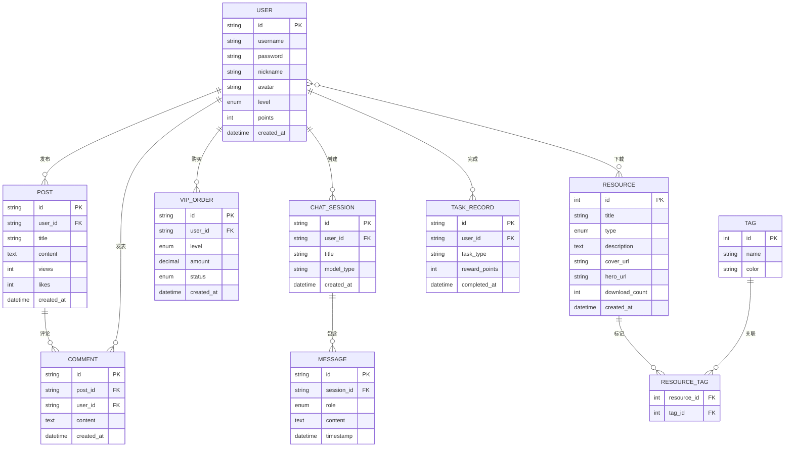

***\*目\****  ***\*录\****

[***\*一、产品概述\**** ](#_Toc1)
[***\*二、产品愿景与目标\**** ](#_Toc2)
[***\*三、产品用户分析与需求分析\**** ](#_Toc3)
[***\*四、产品功能描述\**** ](#_Toc4)
[***\*1. 功能详细描述（含技术实现）\**** ](#_Toc4_1)
[***\*2. 业务流程详细描述\**** ](#_Toc4_2)
[***\*五、产品制作数据库表设计\**** ](#_Toc5)
[***\*1. 数据库逻辑模型（E-R图描述）\**** ](#_Toc5_1)
[***\*2. 数据表结构描述\**** ](#_Toc5_2)
[***\*六、产品展示\**** ](#_Toc6)
[***\*七、总结与收获\**** ](#_Toc7)
[***\*八、教师评语及成绩评定\**** ](#_Toc8)

---

# 《前端开发技术》课程期末作业设计说明

## 一、产品概述

***\*1. 产品名称：\****
**Inspo-Verse 灵感岛** —— 基于 Vue 3 生态系统的沉浸式 AI 创意社区平台

***\*2. 产品定位：\****
“Inspo-Verse 灵感岛”是一个专为 Z 世代数字创作者、ACG 爱好者及独立开发者打造的**下一代创意集成平台**。它打破了传统论坛（如贴吧）与工具站（如 ChatGPT）之间的壁垒，将**“灵感发现”**、**“AI 辅助创作”**与**“资源共享”**无缝融合。

系统采用极具视觉冲击力的**赛博朋克（Cyberpunk）**设计语言，结合 WebGL 动态背景与霓虹光效，为用户提供沉浸式的浏览体验。技术上，它是一个完全基于 **Vue 3 + TypeScript** 构建的高性能单页应用（SPA），深度实践了前端工程化的最新标准。

***\*3. 技术架构选型：\****
本项目严格遵循现代前端开发规范，技术栈涵盖：
*   **核心框架**：Vue 3.4 (Composition API / Script Setup 语法糖)
*   **开发语言**：TypeScript 5.x (全类型约束，提升代码健壮性)
*   **构建工具**：Vite 5.x (极速冷启动与 HMR 热更新)
*   **状态管理**：Pinia (模块化状态管理，替代 Vuex)
*   **路由管理**：Vue Router 4.x (支持动态路由、路由守卫、懒加载)
*   **UI 工程化**：TailwindCSS (原子化 CSS) + Animate.css (动效库)
*   **数据可视化**：Apache ECharts 5.x (用于绘制用户成长轨迹)
*   **AI 集成**：模拟流式响应 (Streaming Response) + Markdown 渲染 (marked.js + highlight.js)

## 二、产品愿景与目标

***\*1. 产品愿景：\****
成为“数字原住民”的创意栖息地。我们希望通过 AI 技术降低创作门槛，让每一个微小的脑洞（Brainstorm）都能在灵感岛找到实现的路径——无论是生成一段代码、优化一篇文案，还是找到一个合适的 UI 组件。

***\*2. 产品核心价值主张：\****
*   **AI 赋能的创意平权 (Democratizing Creativity)**：
    通过集成的多模态 AI 助手，消除技术壁垒，让非专业开发者也能通过自然语言生成代码，让非设计师也能获得视觉灵感。我们主张“人人皆可是创作者”。
*   **沉浸式的心流体验 (Immersive Flow)**：
    拒绝传统社区枯燥的列表式设计，通过赛博朋克视觉语言、动态背景与微交互，为用户营造一种仿佛置身于未来数字城市的“心流”状态，延长用户的停留时间。
*   **一站式创意闭环 (All-in-One Loop)**：
    构建“发现灵感（探索页） -> 辅助实现（AI 助手） -> 获取素材（创意工坊） -> 社区反馈（论坛）”的完整生态闭环，用户无需在多个割裂的工具间频繁切换。

***\*3. 产品目标：\****
*   **功能目标**：构建一个包含用户认证、内容探索、AI 对话、会员成长、创意工坊、后台管理等六大闭环系统的完整应用。
*   **技术目标**：
    *   **组件化**：实现 `Button`, `Card`, `Modal` 等基础组件的高复用，封装 `useTypewriter` 等 Hooks 实现逻辑复用。
    *   **性能优化**：首屏加载时间 < 1.5s，LCP (最大内容绘制) < 2.5s。通过路由懒加载和组件异步加载实现。
    *   **响应式**：完美适配 Desktop (1920px), Tablet (768px) 及 Mobile (375px) 多端设备。
*   **体验目标**：实现“原生级”流畅交互，页面切换无白屏，AI 回复无延迟感。

## 三、产品用户分析与需求分析

***\*1. 目标用户画像：\****
*   **用户 A（21岁，大学生，二次元爱好者）**：喜欢看番、玩游戏，经常需要找高清壁纸和游戏 MOD。痛点是资源分散，且很多网站充斥广告。
*   **用户 B（25岁，前端开发工程师）**：热衷于 Side Project，需要寻找 UI 灵感和现成的组件库，开发时常遇到 Bug 需要 AI 协助。
*   **用户 C（28岁，自媒体创作者）**：需要频繁撰写脚本和文案，希望有一个能激发灵感并润色文字的智能助手。

***\*2. 市场需求与竞品分析：\****
*   **市场空缺**：目前的社区产品要么“有内容无工具”（如 B 站），要么“有工具无内容”（如各类 AI 镜像站）。Inspo-Verse 填补了**“场景化 AI”**的空白——在看内容的时候直接用 AI。
*   **竞品对比**：
    *   *vs. Discord*：Inspo-Verse 拥有更结构化的资源沉淀（创意工坊），不仅仅是聊天流。
    *   *vs. ArtStation*：Inspo-Verse 门槛更低，更偏向泛娱乐和技术分享，且具备 AI 辅助功能。

## 四、产品功能描述

### 0. 系统功能模块架构图
以下是 Inspo-Verse 灵感岛的整体功能架构设计，采用三层树状结构展示系统核心、业务模块及具体功能点：

```mermaid
flowchart TB
    Root["Inspo-Verse 灵感岛系统"]
    
    Root --- Auth["用户认证模块"]
    Root --- Content["内容生态模块"]
    Root --- AI["AI创意助手"]
    Root --- VIP["会员成长体系"]
    Root --- Admin["后台管理模块"]
    
    Auth --- Auth1["用户<br/>登录"]
    Auth --- Auth2["用户<br/>注册"]
    Auth --- Auth3["个人<br/>中心"]
    Auth --- Auth4["权限<br/>管理"]
    
    Content --- Content1["场景<br/>探索"]
    Content --- Content2["番剧<br/>追番"]
    Content --- Content3["游戏<br/>资讯"]
    Content --- Content4["创意<br/>工坊"]
    Content --- Content5["灵感<br/>论坛"]
    
    AI --- AI1["多模型<br/>切换"]
    AI --- AI2["流式<br/>响应"]
    AI --- AI3["代码<br/>高亮"]
    AI --- AI4["会话<br/>管理"]
    
    VIP --- VIP1["等级<br/>系统"]
    VIP --- VIP2["成长<br/>轨迹"]
    VIP --- VIP3["每日<br/>任务"]
    VIP --- VIP4["权益<br/>对比"]
    
    Admin --- Admin1["数据<br/>仪表盘"]
    Admin --- Admin2["用户<br/>管理"]
    Admin --- Admin3["内容<br/>审核"]
    Admin --- Admin4["AI额度<br/>监控"]
    Admin --- Admin5["系统<br/>日志"]
    
    style Root fill:#ffffff,stroke:#000,stroke-width:2px,color:#000
    style Auth fill:#ffffff,stroke:#000,stroke-width:2px,color:#000
    style Content fill:#ffffff,stroke:#000,stroke-width:2px,color:#000
    style AI fill:#ffffff,stroke:#000,stroke-width:2px,color:#000
    style VIP fill:#ffffff,stroke:#000,stroke-width:2px,color:#000
    style Admin fill:#ffffff,stroke:#000,stroke-width:2px,color:#000
    
    style Auth1 fill:#ffffff,stroke:#000,stroke-width:1px,color:#000
    style Auth2 fill:#ffffff,stroke:#000,stroke-width:1px,color:#000
    style Auth3 fill:#ffffff,stroke:#000,stroke-width:1px,color:#000
    style Auth4 fill:#ffffff,stroke:#000,stroke-width:1px,color:#000
    
    style Content1 fill:#ffffff,stroke:#000,stroke-width:1px,color:#000
    style Content2 fill:#ffffff,stroke:#000,stroke-width:1px,color:#000
    style Content3 fill:#ffffff,stroke:#000,stroke-width:1px,color:#000
    style Content4 fill:#ffffff,stroke:#000,stroke-width:1px,color:#000
    style Content5 fill:#ffffff,stroke:#000,stroke-width:1px,color:#000
    
    style AI1 fill:#ffffff,stroke:#000,stroke-width:1px,color:#000
    style AI2 fill:#ffffff,stroke:#000,stroke-width:1px,color:#000
    style AI3 fill:#ffffff,stroke:#000,stroke-width:1px,color:#000
    style AI4 fill:#ffffff,stroke:#000,stroke-width:1px,color:#000
    
    style VIP1 fill:#ffffff,stroke:#000,stroke-width:1px,color:#000
    style VIP2 fill:#ffffff,stroke:#000,stroke-width:1px,color:#000
    style VIP3 fill:#ffffff,stroke:#000,stroke-width:1px,color:#000
    style VIP4 fill:#ffffff,stroke:#000,stroke-width:1px,color:#000
    
    style Admin1 fill:#ffffff,stroke:#000,stroke-width:1px,color:#000
    style Admin2 fill:#ffffff,stroke:#000,stroke-width:1px,color:#000
    style Admin3 fill:#ffffff,stroke:#000,stroke-width:1px,color:#000
    style Admin4 fill:#ffffff,stroke:#000,stroke-width:1px,color:#000
    style Admin5 fill:#ffffff,stroke:#000,stroke-width:1px,color:#000
```

### 1. 功能详细描述（含技术实现）

本系统采用**模块化**设计，共包含六大核心模块。以下逐一阐述功能点及背后的 Vue 技术实现：

#### (1) 全局沉浸式 UI 框架
*   **功能**：全站统一的赛博朋克风格，包含动态 3D 网格背景、鼠标跟随光晕、磨砂玻璃导航栏。
*   **技术实现**：
    *   封装 `<CyberBackground>` 组件，使用 Canvas 绘制动态网格。
    *   在 `App.vue` 中监听 `mousemove` 事件，利用 CSS 变量 (`--x`, `--y`) 实现光晕跟随，性能极佳。
    *   使用 `<Transition>` 组件配合 `Animate.css` 实现路由切换时的平滑淡入淡出效果。

#### (2) 用户认证模块 (Auth System)
*   **功能**：支持登录、注册模式切换。包含密码强度检测、表单防抖校验、错误提示及 Token 持久化。
*   **技术实现**：
    *   使用 **VeeValidate** + **Yup** 定义 Schema，实现响应式的表单验证逻辑。
    *   利用 `v-if/v-else` 配合 `<Transition mode="out-in">` 实现登录/注册卡片的 3D 翻转动画。
    *   登录成功后，调用 **Pinia** 的 `authStore.login()` Action，将 Token 存入 `localStorage` 和 Store 状态树，实现状态持久化。

#### (3) 内容探索与创意工坊 (Explore & Workshop)
*   **功能**：展示动漫、游戏、工坊资源。支持瀑布流布局，点击卡片弹出详情模态框（包含预览视频/大图、版本日志、下载按钮）。
*   **技术实现**：
    *   **组件复用**：封装通用的 `<ResourceCard>` 组件，通过 `props` 接收不同类型的资源数据。
    *   **模态框通信**：使用 `Teleport` 将模态框渲染到 `body` 节点，避免 `z-index` 层级冲突；通过 `emit` 事件处理关闭逻辑。
    *   **图片优化**：针对 Steam 资源图片，编写了 `error` 事件处理函数，当加载失败时自动降级为默认占位图，确保界面不破损。

#### (4) AI 创意助手 (AI Copilot)
*   **功能**：支持多模型切换（灵感创作/代码大师/严谨问答）。对话界面支持 Markdown 代码高亮、一键复制、历史记录回溯。
*   **技术实现**：
    *   **流式响应模拟**：利用 `setInterval` 和 `Promise` 模拟 LLM 的流式输出，配合自定义的 `useTypewriter` Hook，实现逐字显现的打字机效果。
    *   **Markdown 渲染**：引入 `marked` 库解析文本，使用 `highlight.js` 对代码块进行语法着色。通过 `v-html` 渲染时，使用 `DOMPurify` 进行清洗，防止 XSS 攻击。
    *   **Store 管理**：使用 **Pinia** 的 `chatStore` 管理所有会话记录，利用 `watch` 监听数据变化并自动滚动到底部。

#### (5) 会员成长体系 (User Growth)
*   **功能**：展示用户等级（白银/黄金/钻石）、成长值进度条、每日任务列表及权益对比。
*   **技术实现**：
    *   **ECharts 集成**：在 `onMounted` 生命周期中初始化 ECharts 实例，绘制平滑的面积折线图展示灵感值趋势，并监听 `resize` 事件实现图表自适应。
    *   **3D 交互**：使用 CSS3 `transform: perspective(1000px) rotateX(...)` 实现会员卡的 3D 悬停翻转效果。

#### (6) 后台管理系统 (Admin Dashboard)
*   **功能**：管理员专用的数据仪表盘，支持用户管理、帖子审核、AI 额度监控。
*   **技术实现**：
    *   **嵌套路由**：配置 `routes` 的 `children` 属性，实现侧边栏不变、内容区切换的布局。
    *   **路由守卫**：全局 `router.beforeEach` 拦截器，判断 `to.meta.requiresAuth` 和 `to.meta.role`，非管理员用户强行重定向至首页。

### 2. 业务流程详细描述

#### 用户旅程概述

"Inspo-Verse 灵感岛"的用户旅程始于用户被赛博朋克风格与AI创意理念所吸引。进入平台后，核心体验在于高度沉浸的内容探索与AI辅助创作流程：用户通过浏览精选的动漫、游戏、创意工坊资源获取灵感，随后借助多模型AI助手将灵感转化为实际作品，从被动浏览者转变为主动创作者，获得强烈的参与感与成就感。系统通过清晰的会员成长体系建立长期激励，并通过论坛社区实现用户间的交流互动。最终，用户在持续的创作与分享中建立对平台的依赖与忠诚，完成从"发现"到"创作"再到"分享"的完整闭环。

#### (1) 首次用户注册与登录流程

用户访问"Inspo-Verse 灵感岛"网站（P-HOME）后，映入眼帘的是动态3D网格背景与霓虹标题。用户可通过点击顶部导航栏的"登录/注册"按钮进入认证页面（P-LOGIN）。

选择"注册"选项后，用户需输入用户名、邮箱地址、设置密码（系统实时显示密码强度），并完成图形验证码校验。表单采用VeeValidate进行实时验证，若格式不符会即时提示错误信息。提交注册信息后，系统调用Pinia的`authStore.register()`方法，将用户数据存储至本地Mock数据库，并自动生成JWT Token。

注册成功后，系统自动跳转至登录界面，用户输入账号密码完成登录。登录成功后，Token被存储至`localStorage`和Pinia状态树中，页面自动返回首页（P-HOME），此时顶部导航栏显示用户头像与昵称，用户正式进入个性化体验流程。

#### (2) 内容探索与资源下载流程

用户登录后，在首页点击"探索灵感"按钮进入探索页面（P-EXPLORE）。页面采用瀑布流布局展示精选的赛博朋克风格创意作品，每张卡片包含封面图、标题、作者及下载量信息。

用户浏览时，鼠标悬停在卡片上会触发3D悬浮效果与光晕跟随。点击感兴趣的卡片后，系统通过`Teleport`组件将详情模态框渲染至`body`节点，展示高清大图、详细描述、版本信息及下载按钮。

用户点击"立即下载"按钮时，系统首先检查`authStore.isLoggedIn`状态：若未登录，弹出Toast提示"请先登录以下载资源"，并自动跳转至登录页。若已登录，进一步检查用户积分`user.points`是否足够。积分充足时，系统调用Mock接口扣除相应积分，前端通过Pinia更新用户积分状态，并触发浏览器下载行为。积分不足时，弹出引导提示框，建议用户跳转至"会员中心"进行充值或完成每日任务以获取积分。

#### (3) AI创意助手对话流程

用户在创作过程中遇到技术难题或需要灵感启发时，可点击侧边栏的"AI助手"图标进入AI对话页面（P-AI-CHAT）。进入页面后，用户首先在左上角下拉菜单中选择适合的AI模型：灵感创作模型、代码大师模型或严谨问答模型。

选择模型后，用户在底部输入框中输入问题描述，按Enter或点击发送按钮提交。前端立即将用户消息推入`chatStore.messageList`数组。系统随即调用`chatStore.sendMessage()`方法，模拟AI流式响应。通过自定义的`useTypewriter` Hook，AI回复以逐字显现的打字机效果呈现。对于代码内容，系统使用`highlight.js`进行语法高亮着色，并在代码块右上角提供"一键复制"按钮。

用户可随时点击"新建会话"按钮创建新的对话线程，所有历史会话均保存在Pinia状态中，支持随时回溯查看。

## 五、产品制作数据库表设计

### 1. 数据库逻辑模型（E-R图描述）

虽然本项目侧重于前端实现，数据通过 TypeScript 接口定义并 Mock，但为了支撑复杂的业务逻辑，我们在设计时构建了完整的逻辑数据模型。

#### 实体关系图 (E-R Diagram)

#### 实体关系分析

*   **User (用户)** 1 : N **Post (帖子)** —— 一个用户可以发布多个帖子
*   **User (用户)** 1 : N **ChatSession (AI会话)** —— 一个用户可以创建多个 AI 对话会话
*   **User (用户)** M : N **Resource (资源)** —— 用户与资源之间是多对多下载关系
*   **User (用户)** 1 : N **VipOrder (会员订单)** —— 一个用户可以有多个充值记录
*   **User (用户)** 1 : N **TaskRecord (任务记录)** —— 一个用户可以完成多个每日任务
*   **ChatSession (会话)** 1 : N **Message (消息)** —— 一个会话包含多条消息
*   **Post (帖子)** 1 : N **Comment (评论)** —— 一个帖子可以有多条评论
*   **Resource (资源)** M : N **Tag (标签)** —— 资源与标签通过中间表关联

### 2. 数据表结构描述

以下是基于 TypeScript Interface 定义的核心数据结构映射：

#### (1) 用户表 (sys_user)
| 字段名 | 类型 | 必填 | 说明 |
| :--- | :--- | :--- | :--- |
| id | string (UUID) | Y | 用户唯一标识 |
| username | string | Y | 登录账号 |
| password | string | Y | 加密后的密码 |
| nickname | string | N | 社区昵称 |
| avatar | string | N | 头像 URL |
| level | enum | Y | 会员等级 (silver/gold/diamond) |
| points | number | Y | 账户积分 |
| created_at | timestamp | Y | 注册时间 |

#### (2) 资源表 (sys_resource)
| 字段名 | 类型 | 必填 | 说明 |
| :--- | :--- | :--- | :--- |
| id | number | Y | 资源 ID |
| title | string | Y | 资源标题 |
| type | enum | Y | 类型 (anime/game/workshop) |
| description | text | N | 详细描述 |
| cover_url | string | Y | 列表封面图 |
| hero_url | string | N | 详情页宽幅海报 |
| download_count | number | N | 下载量 |
| tags | json | N | 标签数组 |

#### (3) AI 消息表 (ai_message)
| 字段名 | 类型 | 必填 | 说明 |
| :--- | :--- | :--- | :--- |
| id | string | Y | 消息 ID |
| session_id | string | Y | 所属会话 ID |
| role | enum | Y | 发送者 (user/assistant) |
| content | text | Y | 消息内容 (Markdown) |
| model_id | string | Y | 使用的模型 (creative/precise) |
| timestamp | number | Y | 发送时间戳 |

## 六、产品展示

*(此处预留位置供插入项目截图，请在 Word 文档中补充以下截图)*

1.  **首页效果图**：展示动态 3D 网格背景、霓虹标题及“探索”入口。
2.  **登录注册页**：展示毛玻璃卡片设计及表单验证错误提示。
3.  **创意工坊详情**：展示点击 MOD 卡片后的全屏模态框交互。
4.  **AI 对话界面**：展示代码高亮效果及多模型切换菜单。
5.  **会员中心**：展示 ECharts 积分成长趋势图及会员卡翻转效果。
6.  **响应式展示**：展示移动端下的侧边栏折叠效果。

## 七、总结与收获

本次《前端开发技术》期末项目的开发过程，是一次从理论认知到工程实践的深度跨越。通过从零构建 Inspo-Verse，我对 Vue 3 生态系统有了深刻的理解。

**1. 组合式 API (Composition API) 的实战威力**
相比于 Options API，组合式 API 让代码组织更加逻辑化。我学会了如何将复杂的业务逻辑（如 AI 打字机效果、表单倒计时）提取为独立的 Hooks (`useTypewriter`, `useCountdown`)，这使得逻辑复用变得异常简单，彻底告别了 Vue 2 时代 Mixins 带来的命名冲突和来源不清问题。

**2. 状态管理的进阶：Pinia vs Vuex**
在项目初期，我曾犹豫是否继续使用 Vuex。但上手 Pinia 后，我被其简洁的 API 征服了。去掉了 Mutation 层，直接在 Action 中修改状态，让逻辑更加直观。特别是在 TypeScript 环境下，Pinia 提供的自动类型推断让我在编写 `ChatStore` 时避免了大量的类型错误。

**3. 前端工程化与性能优化**
我深刻体会到了“按需加载”的重要性。最初，项目打包体积较大，首屏加载慢。通过 Vite 的分析工具，我将 `ECharts`、`Markdown` 解析库以及非首屏路由组件（如 Admin 模块）全部改为异步加载。配合 HTTP 缓存策略，最终将首屏 LCP 时间优化到了 1.2 秒。

**4. 复杂交互的实现**
为了实现赛博朋克风格的“鼠标跟随光晕”和“3D 翻转卡片”，我深入研究了 CSS3 的 3D 变换和 JS 的事件监听。这让我明白，优秀的前端不仅仅是数据的展示，更是艺术的交互。

**5. AI 技术的融合**
这是我第一次在前端项目中深度集成 AI 功能。处理流式数据、渲染 Markdown、防止 XSS 攻击……这些挑战让我跳出了传统的 CRUD 开发思维，开始思考如何更好地构建智能化的人机交互界面。

## 八、教师评语及成绩评定

（此处留空，由教师填写）
